# TASK MASTER - Detomo SQL AI

**Project**: Detomo SQL AI
**Version**: 1.0
**Start Date**: 2025-10-25
**Target Completion**: 8 weeks

---

## Project Overview

Detomo SQL AI is an AI-powered Text-to-SQL application using Claude Agent SDK and Vanna AI to convert natural language (Japanese/English) to SQL queries with auto-generated visualizations.

**Tech Stack**: Claude Agent SDK, Vanna AI, ChromaDB/PGVector, PostgreSQL (Chinook), Flask, Python 3.10+

---

## Overall Progress

**Total Tasks**: 12
**Completed**: 2/12 (17%)
**In Progress**: 0/12
**Not Started**: 10/12
**Blocked**: 0/12

```
Progress: [███░░░░░░░░░░░░░░░░░] 17%
```

---

## Phase Summary

| Phase | Tasks | Estimate | Status | Progress |
|-------|-------|----------|--------|----------|
| Phase 1: Foundation | 4 tasks | 30 hours | In Progress | 50% |
| Phase 2: API Development | 1 task | 16 hours | Not Started | 0% |
| Phase 3: Frontend | 1 task | 24 hours | Not Started | 0% |
| Phase 4: Testing & Optimization | 4 tasks | 44 hours | Not Started | 0% |
| Phase 5: Deployment | 1 task | 16 hours | Not Started | 0% |
| Phase 6: Polish & Launch | 1 task | 16 hours | Not Started | 0% |
| **TOTAL** | **12 tasks** | **146 hours** | | **0%** |

---

## Task List

### 🔴 PHASE 1: FOUNDATION (Week 1-2)
**Goal**: Setup backend infrastructure and training data

#### ✅ Task 01: Verify Chinook Database
- **File**: [tasks/TASK_01_setup_chinook_database.md](tasks/TASK_01_setup_chinook_database.md)
- **Priority**: 🔴 HIGH
- **Assignee**: Backend Developer
- **Estimate**: 30 minutes ⚡ (Updated: SQLite instead of PostgreSQL)
- **Status**: ✅ Completed
- **Dependencies**: None
- **Deliverables**:
  - ✅ Chinook SQLite database verified (data/chinook.db)
  - ✅ All 11 tables confirmed with data
  - ✅ Connection test scripts passing
  - ✅ .env file with DB_PATH configuration

**Completion**: ☑ 100%
**Completed Date**: 2025-10-25
**Notes**: SQLite database verified with 11 tables, 15,617 total rows. All queries working correctly.

**Note**: Database type changed from PostgreSQL to SQLite for simpler setup.

---

#### ✅ Task 02: Create Training Data Files
- **File**: [tasks/TASK_02_create_training_data.md](tasks/TASK_02_create_training_data.md)
- **Priority**: 🔴 HIGH
- **Assignee**: Data Engineer / AI Engineer
- **Estimate**: 16 hours
- **Status**: ✅ Completed
- **Dependencies**: Task 01
- **Deliverables**:
  - ✅ 11 DDL files + 1 relationships file (12 total)
  - ✅ 10 documentation files + 1 business rules (11 total)
  - ✅ 4 Q&A JSON files (70 Q&A pairs total)
  - ✅ All files UTF-8 encoded

**Completion**: ☑ 100%
**Completed Date**: 2025-10-25
**Notes**: Created 12 DDL files, 11 documentation files, and 70 Q&A pairs (20 basic, 15 aggregation, 15 join, 20 Japanese queries). All JSON files validated successfully.

---

#### ✅ Task 03: Implement DetomoVanna Class
- **File**: [tasks/TASK_03_implement_detomo_vanna.md](tasks/TASK_03_implement_detomo_vanna.md)
- **Priority**: 🔴 HIGH
- **Assignee**: AI Engineer
- **Estimate**: 8 hours
- **Status**: ⏸️ Not Started
- **Dependencies**: Task 01, Task 02
- **Deliverables**:
  - ✅ src/detomo_vanna_dev.py (Development)
  - ✅ src/detomo_vanna_prod.py (Production)
  - ✅ src/config.py (Configuration)
  - ✅ requirements.txt
  - ✅ Unit tests passing

**Completion**: ☐ 0%

---

#### ✅ Task 04: Training Script Implementation
- **File**: [tasks/TASK_04_training_script.md](tasks/TASK_04_training_script.md)
- **Priority**: 🔴 HIGH
- **Assignee**: AI Engineer
- **Estimate**: 4 hours
- **Status**: ⏸️ Not Started
- **Dependencies**: Task 02, Task 03
- **Deliverables**:
  - ✅ scripts/train_chinook.py
  - ✅ scripts/reset_training.py
  - ✅ scripts/check_training.py
  - ✅ Vector database populated (90+ items)

**Completion**: ☐ 0%

---

### 🟡 PHASE 2: API DEVELOPMENT (Week 3)
**Goal**: Build REST API endpoints

#### ✅ Task 05: Flask API Development
- **File**: [tasks/TASK_05_flask_api.md](tasks/TASK_05_flask_api.md)
- **Priority**: 🔴 HIGH
- **Assignee**: Backend Developer
- **Estimate**: 16 hours
- **Status**: ⏸️ Not Started
- **Dependencies**: Task 03, Task 04
- **Deliverables**:
  - ✅ app.py with 6+ endpoints
  - ✅ API documentation (Swagger)
  - ✅ Error handling & logging
  - ✅ API tests (≥80% coverage)

**Completion**: ☐ 0%

---

### 🟢 PHASE 3: FRONTEND DEVELOPMENT (Week 4-5)
**Goal**: Customize UI with Detomo branding

#### ✅ Task 06: UI Customization
- **File**: [tasks/TASK_06_ui_customization.md](tasks/TASK_06_ui_customization.md)
- **Priority**: 🟡 MEDIUM
- **Assignee**: Frontend Developer
- **Estimate**: 24 hours
- **Status**: ⏸️ Not Started
- **Dependencies**: Task 05
- **Deliverables**:
  - ✅ Detomo-branded UI
  - ✅ Chat interface
  - ✅ Admin panel
  - ✅ Japanese language support
  - ✅ Mobile responsive

**Completion**: ☐ 0%

---

### 🔵 PHASE 4: TESTING & OPTIMIZATION (Week 6)
**Goal**: Quality assurance and performance tuning

#### ✅ Task 07: Testing & QA
- **File**: [tasks/TASK_07_testing_qa.md](tasks/TASK_07_testing_qa.md)
- **Priority**: 🔴 HIGH
- **Assignee**: QA Engineer / AI Engineer
- **Estimate**: 16 hours
- **Status**: ⏸️ Not Started
- **Dependencies**: Task 05, Task 06
- **Deliverables**:
  - ✅ 50+ SQL accuracy tests (≥85% accuracy)
  - ✅ Performance test report
  - ✅ Load testing results (100 users)
  - ✅ Bug fixes completed

**Completion**: ☐ 0%

---

#### ✅ Task 08: Visualization Enhancement
- **File**: [tasks/TASK_08_visualization.md](tasks/TASK_08_visualization.md)
- **Priority**: 🟡 MEDIUM
- **Assignee**: Frontend Developer
- **Estimate**: 8 hours
- **Status**: ⏸️ Not Started
- **Dependencies**: Task 06
- **Deliverables**:
  - ✅ Custom chart templates
  - ✅ Export functionality (PNG, SVG)
  - ✅ Interactive Plotly charts

**Completion**: ☐ 0%

---

#### ✅ Task 09: Analytics Dashboard
- **File**: [tasks/TASK_09_analytics_dashboard.md](tasks/TASK_09_analytics_dashboard.md)
- **Priority**: 🟡 MEDIUM
- **Assignee**: Full Stack Developer
- **Estimate**: 12 hours
- **Status**: ⏸️ Not Started
- **Dependencies**: Task 05, Task 06
- **Deliverables**:
  - ✅ Query metrics tracking
  - ✅ Usage statistics
  - ✅ Performance dashboard
  - ✅ Error logs viewer

**Completion**: ☐ 0%

---

#### ✅ Task 10: Documentation
- **File**: [tasks/TASK_10_documentation.md](tasks/TASK_10_documentation.md)
- **Priority**: 🟡 MEDIUM
- **Assignee**: Technical Writer / Developer
- **Estimate**: 8 hours
- **Status**: ⏸️ Not Started
- **Dependencies**: All previous tasks
- **Deliverables**:
  - ✅ User guide (EN & JP)
  - ✅ API documentation
  - ✅ Deployment guide
  - ✅ Troubleshooting guide

**Completion**: ☐ 0%

---

### 🟣 PHASE 5: DEPLOYMENT (Week 7)
**Goal**: Production deployment

#### ✅ Task 11: Deployment
- **File**: [tasks/TASK_11_deployment.md](tasks/TASK_11_deployment.md)
- **Priority**: 🔴 HIGH
- **Assignee**: DevOps Engineer
- **Estimate**: 16 hours
- **Status**: ⏸️ Not Started
- **Dependencies**: Task 07 (testing completed)
- **Deliverables**:
  - ✅ Docker containers
  - ✅ CI/CD pipeline
  - ✅ Production environment setup
  - ✅ Monitoring & alerting

**Completion**: ☐ 0%

---

### ⚪ PHASE 6: POLISH & LAUNCH (Week 8)
**Goal**: Final touches and launch

#### ✅ Task 12: Advanced Features
- **File**: [tasks/TASK_12_advanced_features.md](tasks/TASK_12_advanced_features.md)
- **Priority**: 🟢 LOW
- **Assignee**: Full Stack Developer
- **Estimate**: 16 hours
- **Status**: ⏸️ Not Started
- **Dependencies**: All core features complete
- **Deliverables**:
  - ✅ Query history
  - ✅ Saved queries
  - ✅ Query templates
  - ✅ Multi-user support (optional)

**Completion**: ☐ 0%

---

## Critical Path

```mermaid
graph LR
    T01[Task 01<br/>Setup DB] --> T02[Task 02<br/>Training Data]
    T02 --> T03[Task 03<br/>DetomoVanna]
    T03 --> T04[Task 04<br/>Training Script]
    T04 --> T05[Task 05<br/>Flask API]
    T05 --> T06[Task 06<br/>UI]
    T06 --> T07[Task 07<br/>Testing]
    T07 --> T11[Task 11<br/>Deployment]
    T11 --> T12[Task 12<br/>Advanced Features]

    style T01 fill:#ff6b6b
    style T02 fill:#ff6b6b
    style T03 fill:#ff6b6b
    style T04 fill:#ff6b6b
    style T05 fill:#ff6b6b
    style T07 fill:#ff6b6b
    style T11 fill:#ff6b6b
```



**Critical Path Tasks**: T01 → T02 → T03 → T04 → T05 → T06 → T07 → T11

---

## Success Metrics

### MVP Requirements (Launch Criteria)
- [ ] SQL accuracy ≥ 75%
- [ ] Response time < 10s (p95)
- [ ] Clean branded UI
- [ ] Japanese & English support
- [ ] Chinook database fully loaded
- [ ] ≥ 50 Q&A training pairs
- [ ] No critical bugs

### V1.0 Success Criteria
- [ ] SQL accuracy ≥ 85%
- [ ] Response time < 5s (p95)
- [ ] User satisfaction ≥ 4/5
- [ ] Support 100+ query patterns
- [ ] 99% uptime
- [ ] 100 concurrent users supported

---

## Risk Dashboard

| Risk | Impact | Probability | Mitigation | Status |
|------|--------|-------------|------------|--------|
| Claude API costs too high | 🔴 High | 🟡 Medium | Aggressive caching, rate limiting | ⚠️ Monitor |
| SQL accuracy < 85% | 🔴 High | 🟡 Medium | More training data, iterative refinement | ⚠️ Monitor |
| Performance issues | 🟡 Medium | 🔴 High | Result pagination, query timeout | ⚠️ Monitor |
| Database security | 🔴 High | 🟢 Low | Read-only user, SQL injection prevention | ✅ OK |

---

## Weekly Status Updates

### Week 1 (2025-10-25 to 2025-10-31)
**Planned**: Tasks 01, 02
**Actual**: -
**Status**: Not Started
**Blockers**: None
**Next Week**: Complete foundation tasks

### Week 2 (2025-11-01 to 2025-11-07)
**Planned**: Tasks 03, 04
**Actual**: -
**Status**: Not Started
**Blockers**: None
**Next Week**: -

[Continue for all 8 weeks...]

---

## Team Assignments

| Role | Team Member | Tasks Assigned | Status |
|------|-------------|----------------|--------|
| Backend Developer | TBD | T01, T05 | Not Started |
| Data Engineer | TBD | T02 | Not Started |
| AI Engineer | TBD | T03, T04, T07 | Not Started |
| Frontend Developer | TBD | T06, T08 | Not Started |
| Full Stack Developer | TBD | T09, T12 | Not Started |
| Technical Writer | TBD | T10 | Not Started |
| DevOps Engineer | TBD | T11 | Not Started |
| QA Engineer | TBD | T07 | Not Started |

---

## Quick Start Guide

### For Team Members

1. **Read PRD**: Start with [PRD.md](PRD.md)
2. **Review Task Master**: This file (TASK_MASTER.md)
3. **Check Your Assigned Task**: See individual task files in `tasks/` folder
4. **Follow CLAUDE.md**: Use [CLAUDE.md](CLAUDE.md) for execution guidance
5. **Update Status**: Keep task status updated in this file

### For Claude Code Assistant

**See**: [CLAUDE.md](CLAUDE.md) for detailed instructions on how to execute each task.

---

## Change Log

| Date | Version | Changes | Author |
|------|---------|---------|--------|
| 2025-10-25 | 1.0 | Initial TASK_MASTER created | Claude |

---

## Notes

- Update task completion percentages daily
- Mark blockers immediately
- Update risk dashboard weekly
- Review critical path weekly
- Conduct phase retrospectives

---

## Legend

**Priority**:
- 🔴 HIGH - Critical path, must complete
- 🟡 MEDIUM - Important, flexible timing
- 🟢 LOW - Nice to have, can defer

**Status**:
- ⏸️ Not Started
- 🏃 In Progress
- ⏳ Blocked
- ✅ Completed
- ✔️ Verified

**Completion**:
- ☐ 0% - Not started
- ◔ 25% - Started
- ◑ 50% - Half done
- ◕ 75% - Nearly done
- ☑ 100% - Complete

---

**Last Updated**: 2025-10-25
**Next Review**: 2025-11-01
